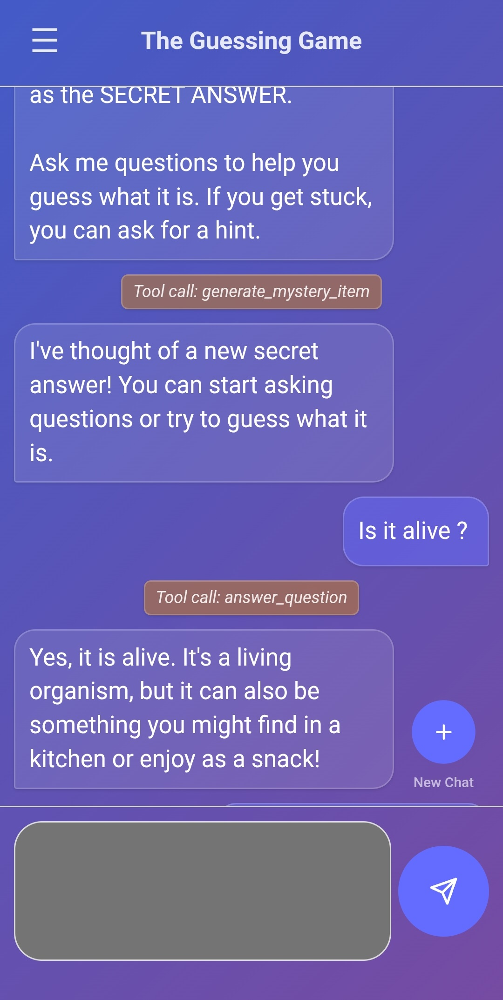
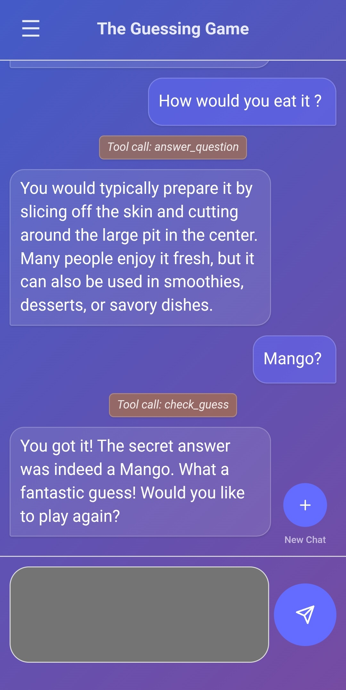

# AI Demos Project

A project showcasing simple LLM applications built with diverse technologies, serving as a personal sandbox for AI app development.

## 🎯 Project Goals

- **AI Agent Development**: Building conversational agents with memory and state management
- **LLM Integration**: Practical implementations using OpenAI, Gemini, and other leading models
- **Full-Stack AI Applications**: Combining modern web technologies with AI backends

## Current Demos

### ❔ The Guessing Game

An interactive guessing game built with **LangGraph**:

- **Stateful Conversations**: Persistent game state and context-aware responses
- **Tool-Based Architecture**: Tool-calling for different game interactions
- **Memory Management**: Automatic cleanup and session persistence

### 🛠️ Tech Stack

- **Python FastAPI**
- **LangGraph/LangSmith** AI agent orchestration and tracing
- **OpenRouter** for multi-model LLM access

## Screenshots





## Project Structure

```
├── backend/
│   ├── src/
│   │   ├── routers/                   # <--- API route handlers
│   │   │   ├── mystery_item_router.py
│   │   │   └── (more routers...)
│   │   │
│   │   ├── services/                  # <--- Business logic & LangGraph agents
│   │   │   ├── mystery_item_service.py
│   │   │   └── (more services...)
│   │   │
│   │   ├── utils/                     # <--- Helper functions & prompts
│   │   │   ├── mystery_item_helpers.py
│   │   │   └── (more utils...)
│   │   │
│   │   └── config/                    # <--- Configuration files
│   │       └── llm_config.py
│   │
│   ├── main.py                        # <--- FastAPI app with router includes
│   └── langgraph.json                 # <--- LangGraph configuration
│
└── frontend/
    └── src/
        ├── views/                     # <--- Page-level components
        │   ├── MysteryItemView/
        │   │   ├── MysteryItemView.tsx
        │   │   └── MysteryItemView.module.css
        │   └── (more views...)
        │
        ├── components/                # <--- Reusable React components
        │   ├── Button/
        │   └── (and more...)
        │
        ├── services/
        │   └── api.ts                 # <--- Centralized API client
        │
        ├── hooks/                     # <--- Custom React hooks
        │   ├── useTheme.ts
        │   └── (more hooks...)
        │
        └── App.tsx                    # <--- Main router & layout
```

## 🔮 More Demos Coming Soon
